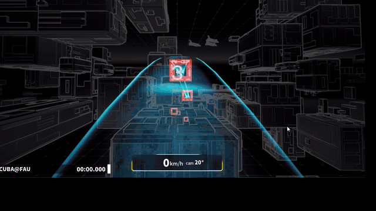
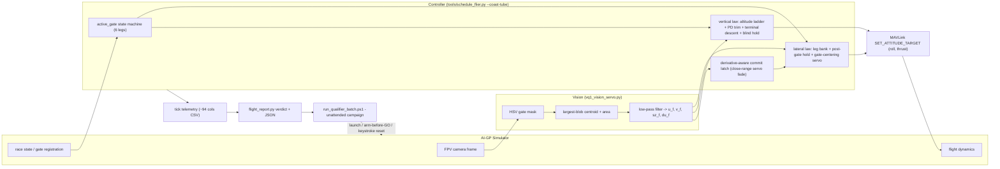
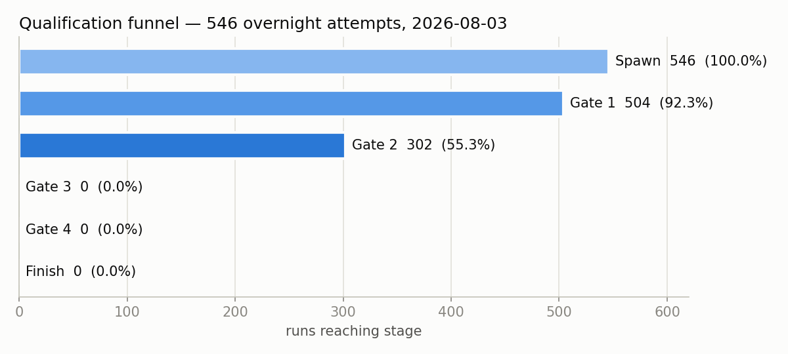
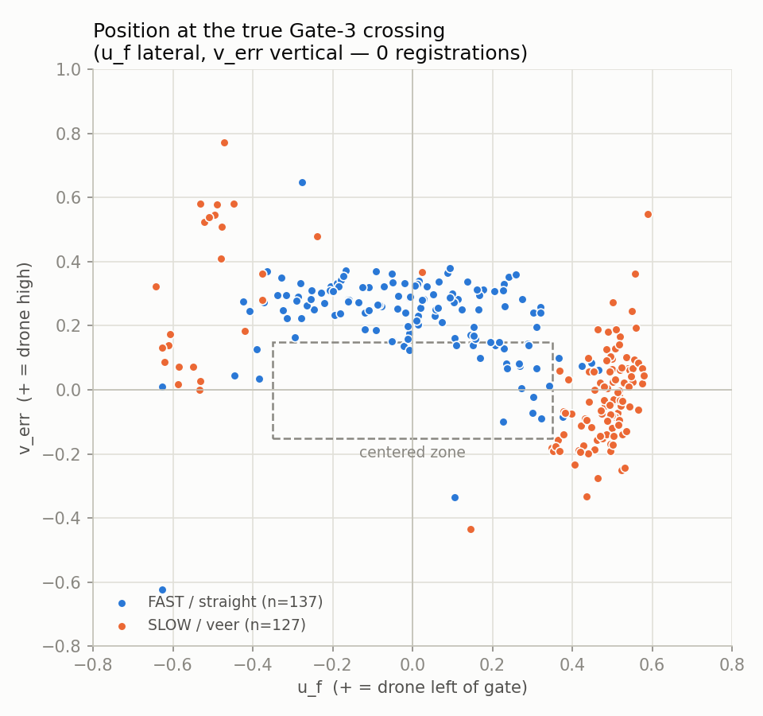

# AI Grand Prix — Vision-Based Autonomous Drone Racing

A vision-only autonomous racing controller for the [Anduril AI Grand Prix](https://www.theaigrandprix.com) Virtual Qualifier: a simulated racing drone flown through a gate course using nothing but a forward camera over MAVLink — no GPS, no position telemetry, no pose — plus the automation and forensic-analysis infrastructure built to campaign it.

    



<sub>Run `flit56`, 2026-07-30 — the controller flying itself from the start countdown through Gate 1 and Gate 2, then banking onto the Gate-3 leg. The only input is the forward camera; the HUD speed and race clock are the simulator's. Full clip: [`docs/media/gate2_pass.mp4`](docs/media/gate2_pass.mp4).</sub>

**Result up front: VQ1 was not qualified.** Gate 3 was never registered in 546 automated attempts. What this repository documents is the engineering around that fact: a classical vision-servo controller that reliably cleared Gates 1–2, an unattended simulator-campaign system that ran all night without intervention, and a 302-run forensic dataset that located the failure mechanism — systematic, not random.

---

## Table of Contents

1. [Result at a Glance](#result-at-a-glance)
2. [The Challenge](#the-challenge)
3. [Architecture](#architecture)
4. [Control Strategy](#control-strategy)
5. [Engineering Results](#engineering-results)
6. [Key Findings](#key-findings)
7. [How to Use](#how-to-use)
8. [Repository Structure](#repository-structure)
9. [What I Personally Built](#what-i-personally-built)
10. [Detailed Documentation](#detailed-documentation)
11. [Research Lab](#research-lab)
12. [References & Acknowledgments](#references--acknowledgments)
13. [License](#license)

---

## Result at a Glance

| Metric | Value |
|---|---|
| Final campaign | **546 automated overnight attempts**, 7.0 h, zero operator interventions |
| Gate 1 passed | **504 / 546 (92.3%)** |
| Gate 2 passed | **302 / 546 (55.3%)** |
| Gate 3 registered | **0 / 546** — the binding constraint |
| Statistical ceiling | 0-for-546 caps per-attempt success below ~0.5% — failure proven systematic |
| Forensic dataset | 302 full Gate-3-leg tick traces (187k control ticks), replayed offline |
| Test suite | 424 passed, 114 skipped (`docs/testing.md`) |
| Automation | Unattended sim lifecycle + race reset + classification + self-purging disk |

## The Challenge

The AI-GP Virtual Qualifier provides a simulated racing drone and a 6-waypoint course (start, four gates, finish). The autonomy contract is deliberately hostile:

| Constraint | Consequence |
|---|---|
| Camera only — no GPS, position, or pose | Whole state estimate = 3 scalars from a blob detector |
| Thrust ceiling, nose-down coast (~−17.8°, uncontrollable pitch) | **No climb authority** — vertical control is descent management only |
| Bank ±11° (tighter on the Gate-3 leg) | Every approach is a one-shot ballistic intercept |
| Gate leaves the camera frame ~2.4 m before its plane | The final ~0.5 s of every approach is flown blind |
| Host loop rate swung 39–117 Hz | Rate became a first-class experimental variable |

## Architecture



Full description: [docs/architecture.md](docs/architecture.md).

## Control Strategy

A classical, inspectable pipeline chosen over end-to-end learning once the observation contract was clear. Per leg of the course: a scheduled feed-forward bank plus a decaying post-gate hold carries the drone between gates; the vision servo centers the next gate laterally (`k·u_f`, clamped per-leg); the vertical law flies a per-leg descent ladder with PD trim on `v_f`. Near a gate, a **derivative-aware commit latch** (aligned *and* low-rate for a real-time dwell) fades the servo out so terminal parallax spikes cannot throw the approach; on the Gate-3 leg a **terminal descent** plus a **bounded blind hold** carry a controlled sink through the final camera-blind meters. Every mechanism ships as a default-off flag; the frozen qualifier configuration is one exact command ([REPRODUCE.md](results/overnight-2026-08-03/REPRODUCE.md)).

Details with equations and verdicts per mechanism: [docs/controller.md](docs/controller.md) · flag reference: [docs/flags.md](docs/flags.md).

## Engineering Results

<picture><source media="(prefers-color-scheme: dark)" srcset="docs/img/funnel_dark.png"></picture>

<picture><source media="(prefers-color-scheme: dark)" srcset="docs/img/crossing_scatter_dark.png"></picture>

The scatter is the project's decisive figure: 302 Gate-3 approaches form **two disjoint populations** — a fast/straight family (laterally centered, residually high) and a slow/veer family (vertically converged, systematically left) — and **zero registrations across the entire sampled error space**. All figures, both themes: [docs/](docs/).

## Key Findings

1. **The failure was systematic, not variance.** Crossing positions sampled the whole error plane; none registered. More attempts could not have qualified this controller — proven, not assumed. Notably, the drone was **visually observed to traverse the Gate-3 opening on several runs** (and 53 runs physically struck the gate frame), yet the simulator's registration signal never fired — the registration criterion itself was never characterized and remains an open question ([postmortem](docs/postmortem.md)).
2. **Two deterministic trajectory populations**, separated at 97.6% by Gate-2→3 transit time alone (3.12 s vs 6.67 s, empty gap between): fast/straight-but-high vs slow/veer-but-level.
3. **The trajectory fork precedes every controller decision** — populations diverge before commit eligibility, under identical commands; the only measured differential is ~0.5° of roll tracking. The commit latch is a terminal-precision instrument (3× better lateral error when latched), not the fork's cause.
4. **A replay-validated commit rule improvement** (86:1 confusion across 302 runs) was found offline but never flown — simulator access ended at the deadline.

Full analysis chain: [docs/findings.md](docs/findings.md) · [docs/postmortem.md](docs/postmortem.md).

## How to Use

The analysis pipeline runs **without the simulator** on shipped data — that is the first-class path today, since qualifier access closed at the deadline.

```bash
# 1. install
git clone https://github.com/click-b8/AI-GrandPrix-.git
cd AI-GrandPrix-
pip install -r requirements.txt

# 2. run the per-run analyzer on a shipped trace (top-10 closest approaches included)
python analysis/flight_report.py results/overnight-2026-08-03/top10_traces/filt_auto_329.csv

# 3. aggregate the campaign (546 attempts)
#    results/overnight-2026-08-03/batch_summary.csv  — one row per attempt; the
#    546-attempt campaign slice is timestamps 03:30:43..10:28:03 of its 633 rows
#    results/overnight-2026-08-03/json/              — per-run JSON records

# 4. run the test suite
python -m pytest tests -q

# 5. full raw dataset (302 Gate-3 traces, 187k ticks) — GitHub Release asset:
#    vq1-overnight-raw-dataset-2026-08-03.tar.gz
#    SHA-256: 2957f75dccf5d113e56b752d2be0edc9a8e7f53ce9c80053c7e5a41263d57081
```

Flying the controller required the competition simulator (online account; access ended 2026-08-03). The exact frozen command, environment assumptions, and batch usage are preserved in [REPRODUCE.md](results/overnight-2026-08-03/REPRODUCE.md).

## Repository Structure

```
AI-GrandPrix-/
├── tools/schedule_flier.py    # THE controller (3.9k lines, --coast-tube mode)
├── vq1_vision_servo.py        # vision pipeline: HSV blob -> u/v/size servo signals
├── automation/                # unattended campaign system (sim lifecycle, reset, batch)
├── analysis/                  # flight_report.py verdict/JSON + trajectory tooling
├── tests/                     # 538 tests: controller logic, latch, batch, MAVLink
├── docs/                      # architecture, controller, findings, postmortem, ...
│   └── img/                   # all figures, light + dark variants
├── results/
│   ├── overnight-2026-08-03/  # the final campaign: summary, JSONs, top-10 traces
│   └── analysis-intermediates/
└── archive/                   # earlier eras, indexed: RL training, DCL hardware,
                               # ~560 manual tuning runs, superseded experiments
```

## What I Personally Built

**Competition-provided:** the simulator (closed binary, not included), its MAVLink/vision UDP interface, and a minimal Python connection example.

**Built in this repository:** everything else — the flight controller and its control laws (`tools/schedule_flier.py`), the vision pipeline (`vq1_vision_servo.py`), the telemetry system (~94-column tick logging), the analysis toolchain (`analysis/`), the unattended campaign automation including simulator process management and input injection (`automation/`), the offline replay/forensics methodology (`docs/findings.md`), the test suite, and all documentation and figures.

## Detailed Documentation

| doc | contents |
|---|---|
| [architecture.md](docs/architecture.md) | System layers, constraints, data flow |
| [controller.md](docs/controller.md) | Every mechanism: law, status (active / experimental / ruled out) |
| [vision.md](docs/vision.md) | Detector, filtering, measured failure modes |
| [flags.md](docs/flags.md) | The 152 CLI flags, grouped and triaged |
| [automation.md](docs/automation.md) | Sim lifecycle, keystroke reset, batch design |
| [overnight_batch.md](docs/overnight_batch.md) | The 546-attempt campaign |
| [findings.md](docs/findings.md) | The two-population analysis + commit-latch replay |
| [postmortem.md](docs/postmortem.md) | Formal engineering postmortem |
| [experiment-history.md](docs/experiment-history.md) | Controller evolution: problem → hypothesis → change → result → decision |
| [testing.md](docs/testing.md) | What the 538 tests actually verify |
| [experiments.md](docs/experiments.md) · [lessons_learned.md](docs/lessons_learned.md) · [future_work.md](docs/future_work.md) | Family verdicts, lessons, next steps |

## Research Lab

This project is affiliated with the **[SCUBA Lab](https://github.com/scubabot)** (Scaling Collaborative Unmanned roBots for Autonomy) at Florida Atlantic University's SeaTech campus, Dania Beach, FL.

## References & Acknowledgments

The **AI Grand Prix** is organized by Anduril Industries in partnership with the Drone Champions League (DCL), Neros Technologies, and JobsOhio; the simulator and course assets are theirs and are not included here. Useful community resources and related work:

- [awesome-autonomous-drone-racing](https://github.com/aimarket/awesome-autonomous-drone-racing) — curated resources for AI-GP, AlphaPilot, A2RL, and Game of Drones
- Hanover et al., *Autonomous Drone Racing: A Survey*, IEEE T-RO 2024
- Foehn et al., *AlphaPilot: Autonomous Drone Racing*, RSS 2020 / Auton. Robots 2022
- Kaufmann et al., *Champion-level Drone Racing using Deep RL* (Swift), Nature 2023 — the RL road considered and deliberately not taken here
- Madaan et al., *AirSim Drone Racing Lab / NeurIPS Game of Drones*, 2020
- Jung et al., *Direct Visual Servoing–based Gate Traversal for Drone Racing*, RA-L 2018

## License

MIT — see [LICENSE](LICENSE). Copyright (c) 2026 Noah Brande. The AI-GP simulator, its assets, and competition materials remain the property of their respective owners.
