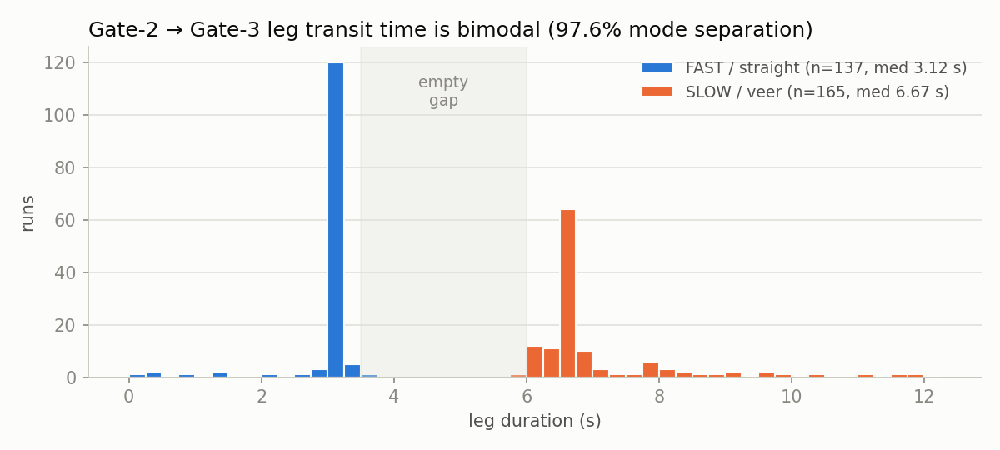
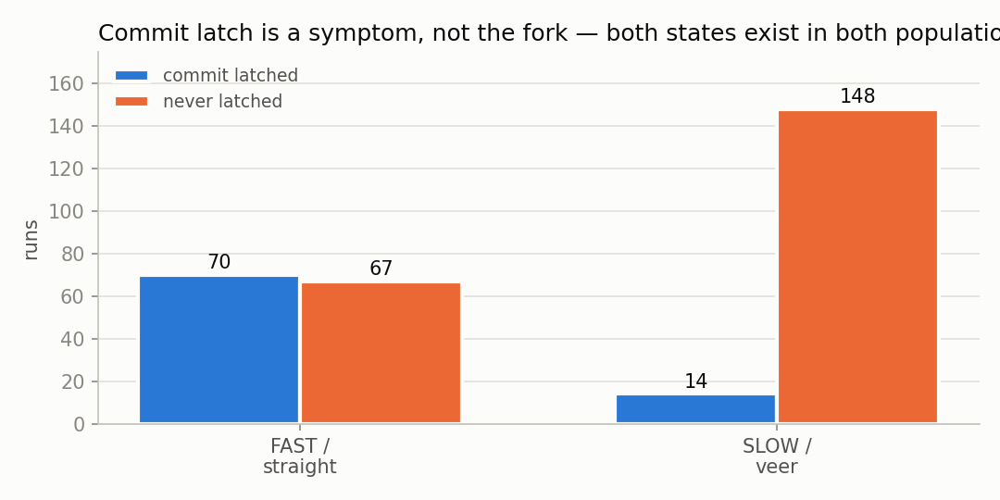
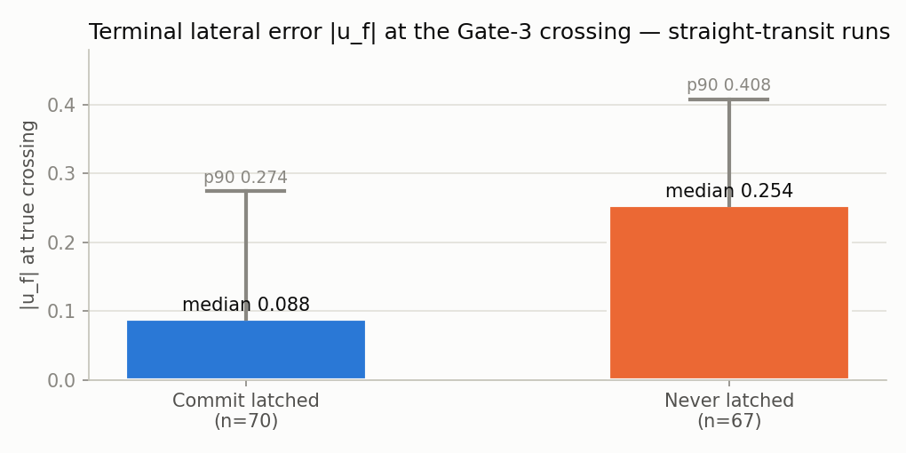

# Findings — the Gate-3 forensic analysis

Two post-campaign investigations ran entirely offline against the overnight dataset (546 summary rows; 302 full Gate-3-leg tick traces, 187,525 ticks). No flights were flown; no parameters were changed. Claims below distinguish what the data proves from what it merely suggests.

## 1. The two-population structure

Gate-2→Gate-3 leg transit time is **perfectly bimodal**: a fast population at 3.12 s (p10–p90 spread of 0.08 s — a deterministic straight transit) and a slow population at 6.67 s, with an empty gap between 3.5 and 6.0 s. The split separates the two miss modes at **97.6% accuracy** — better than any rate variable (full-run median rate: 77.8%).

- **FAST/straight** (n=137): arrives laterally centered, vertically **+0.15…+0.37 high** — the 3.1 s transit gives the terminal descent too little time.
- **SLOW/veer** (n=165): veers left to u_f ≈ +0.42, but arrives vertically centered — the extra 3.5 s lets the vertical servo finish.

An earlier hypothesis — "median loop rate ≥ 88 Hz selects the mode" — was **falsified** by this same analysis: leg duration is uncorrelated with full-run rate (r = −0.003), and the best centered runs came from low-rate machines flying the fast leg. Rate *survives as a correlate* among unlatched runs (100.4 vs 76.2 Hz median) and remains an untested upstream candidate — see §5.

## 2. The fork precedes every controller decision

Population-median tick chains show both populations **identical through t+1.5 s** of the leg — same u_f, same commanded bank (−4.5° schedule hold), same zero servo command — then u_f separates between t+1.5 and t+2.0, *before* the commit latch is eligible and before any differential steering exists. The only measured physical differential: the slow population tracks ~0.5° deeper actual roll under identical commanded roll. A lagged plant-response test (7,547 tick-pairs) cleared the servo of sign inversion: it corrects in the right direction but only *arrests* the veer (−0.04/s under full command vs +0.37/s unopposed) — authority-starved and engaged too late.

**Honest limit:** the data localizes the fork's seed to vehicle roll-tracking under identical commands, correlated with machine rate, but cannot prove the mechanism. The discriminating experiment (pinned-rate A/B) was designed but simulator access ended first.

## 3. The commit latch: symptom, not cause — but a valuable instrument

- 67 fast runs never latched and flew the straight transit anyway; 14 slow runs latched and veered anyway. **The latch neither causes nor prevents the fork.**
- But among fast runs, latched crossings hit |u_f| **0.088** median vs **0.254** unlatched — the latch fades the servo out before a terminal parallax spike (a spurious −9° command in the final 0.3 s) can act. All top-10 closest runs were latched.

<picture><source media="(prefers-color-scheme: dark)" srcset="img/latch_terminal_error_dark.png"></picture>

The gap widens in the tail: p90 **0.274** latched vs **0.408** unlatched. So the latch is worth keeping as an *instrument* — it reliably buys a ~3× tighter terminal error on the runs that reach the plane straight — while remaining, per the bullets above, causally irrelevant to which population a run lands in.

## 4. Latch-failure histogram and the replay-validated rule

Across 299 classifiable runs: **43.1% never armed** (the previous gate's filtered size residual never fell below the 0.16 commit size — a structural blocker), 18.4% never aligned while eligible (the veer's signature), 8.4% rate-broke dwells, 28.1% latched (20.7% genuine, 7.4% questionable). The frozen rule is edge-sitting: p90 of successful dwells reached 0.128 of the 0.13 rate limit and 0.080 of the 0.08 align limit.

A 256-combination offline sweep found a strictly dominating rule — **size 0.20 / align 0.12 / rate 0.16 / dwell 0.15**: 64% of fast runs latched (vs 52%), zero veer-family false latches (vs 14), all top-10 preserved, confusion 86:1. The larger size threshold both cures the arming blocker and delays eligibility past the point where the fork is already visible in u_f. **Never flown** — simulator access ended; it stands as a replay-validated recommendation only.

No commit rule converts the veer population: by eligibility their u_f has left any honest alignment band, and the centroid/derivative signals cannot distinguish the populations before the fork is expressed.

## 5. What was never resolved

1. **The fork's physical seed** — why identical commands produce ~0.5° different roll tracking, and whether machine rate is causal (the designed pinned-rate A/B was never run).
2. **Gate-3's registration tolerance** — 23 runs crossed centered on both axes at gate-loss and none registered; 53 runs physically struck the gate frame. The residual between "centered at the last measurable moment" and "through the opening at the plane" (a blind 2.4 m of parallax-distorted projection) was the final unclosed gap.
3. **Legs 3–5** — never tuned; the post-Gate-3 course remains unflown territory.
