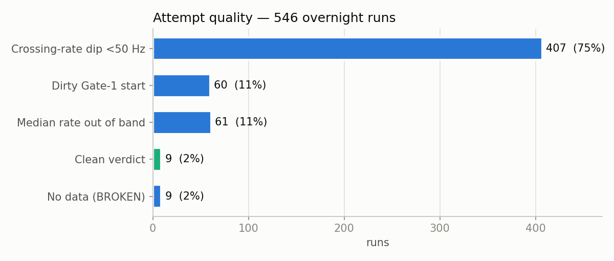
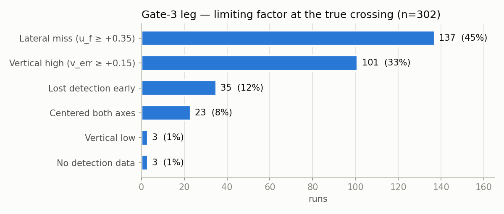
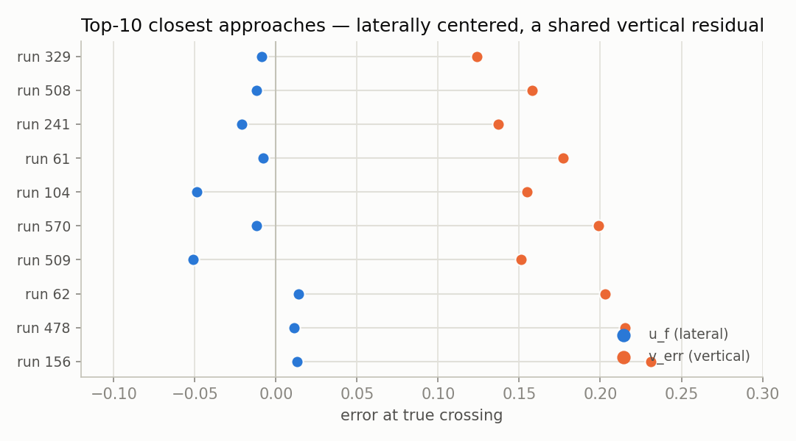

# The overnight batch — 2026-08-03

The final campaign: an unattended best-of-N qualification attempt, run in the last hours of simulator access. Design goal: *if* qualification was reachable by variance, harvest it; if not, produce the dataset that says why not. It produced the second.

## Configuration

- Frozen controller (see [REPRODUCE.md](../results/overnight-2026-08-03/REPRODUCE.md) for the exact 40-flag command).
- `automation/run_qualifier_batch.ps1 -KeepSimAlive -Mode holdblind -HoldSeconds 0.30` — sim logged in once and kept alive; keystroke reset per attempt; stop only on the sim's race-finish signal or `MaxAttempts` 1000.
- Hardware note: ARM Surface translating the x86 sim — loop rate 51–112 Hz across runs, which became a first-class variable in the analysis.

## Execution

| metric | value |
|---|---|
| Attempts | **546** over 7.0 h (03:30:43 – 10:28:03) |
| Cadence | median 44 s/attempt, min 43 s |
| Operator interventions | 0 |
| Automation failures | 0 during the campaign (no runaway cycles, no stray processes, no SIM LOST) — see the note below on what happened after it |
| Data captured | 546 summary rows + JSONs; 302 full Gate-3-leg tick traces; discards self-purged after recording |

`batch_summary.csv` holds **633 rows**, not 546: the campaign slice above, plus 52 setup and debug rows from earlier the same night (01:03–03:27) and 35 rows from after it (10:31–12:28). Every figure and statistic on this page is computed from the 546-row campaign slice, defined by timestamp as `2026-08-03T03:30:43 … 2026-08-03T10:28:03`, which is exactly attempts 1–546 with no gaps.

Those 35 trailing rows are the one honest blemish on the automation record, and they are all `BROKEN`. The simulator stopped producing flights at around 10:28; the batch loop did not detect it, and kept cycling and recording empty attempts for two hours until it was stopped by hand. Nothing was corrupted and no earlier data was affected — but the sim-death guard did not fire, and a loop that cannot tell "no flight" from "a bad flight" will happily run all day. It is listed here rather than trimmed out of the file, because the failure is part of the record.

### Attempt quality

<picture><source media="(prefers-color-scheme: dark)" srcset="img/attempt_quality_dark.png"></picture>

**Provenance.** Computed from the 546-row campaign slice of `results/overnight-2026-08-03/batch_summary.csv` (timestamps `03:30:43 … 10:28:03`). Categories are the verdicts `flight_report` assigned at run time, read from the `class` column — not recomputed after the fact: `DISCARD_RATE` splits on whether `crossing_dips` is populated (407 with, 61 without — of those 61, 28 ran above 90 Hz and 33 below 55 Hz); `DISCARD_DIRTY` → 60; `KEEP_UPSTREAM` + `KEEP_DEEP` → 9; `BROKEN` → 9.

Only **9 of 546 attempts (2%) returned a clean rate verdict.** Loop-rate dips below 50 Hz *at the gate crossings themselves* — the moments the control law can least afford them — affected **407 runs (75%)**, with another 61 out of band on median rate. This is the ARM-translation cost from Configuration above, measured: the host, not the controller, set the quality ceiling on three-quarters of the dataset.

The nine "no data" runs are attempts whose logs never materialized; they are counted here for honesty but are distinct from the automation-failure row above, which tracks the batch loop itself (no runaway cycles, no stray processes, no SIM LOST). The loop never failed — some individual attempts produced nothing to classify.

This is also why the discard-and-purge policy mattered: at a 2% clean rate, keeping every run would have buried the signal in 537 rows of host noise.

## Results

| stage | runs | % |
|---|---|---|
| Spawn | 546 | 100% |
| Passed Gate 1 | 504 | 92.3% |
| Passed Gate 2 | 302 | 55.3% |
| **Registered Gate 3** | **0** | **0.0%** |
| Gate 4 / 5 / finish | 0 | — |

Physical outcomes on the Gate-3 leg (sim collision log): 53 runs struck Gate 3's frame at t≈11.5 s — they *reached the plane* and clipped it; ~124 missed the opening and hit ground ~3.5 s later; 50 clipped Gate 2's frame while passing it.

## The statistical verdict

Crossing positions sampled the entire error space — laterally −0.63…+0.59, vertically −0.62…+0.91, including 23 runs centered on both axes — and **none registered**. If per-attempt registration probability were even 1%, the chance of 0-for-546 is ~0.4%; the data caps p below ~0.5% per attempt for this configuration. **The failure was systematic. More attempts could not have qualified this controller**, and the batch's real product is that certainty plus the forensic dataset that located the mechanism — see [findings.md](findings.md).

## Top-10 closest approaches

All ten: laterally centered (|u_f| ≤ 0.05), deep (size 0.50–0.59), a shared +0.12…+0.23 vertical residual at gate loss, commit latched at t+2.1–2.6 with settled dwells. One family, one residual — the tightest description of "what stood between this controller and Gate 3."
